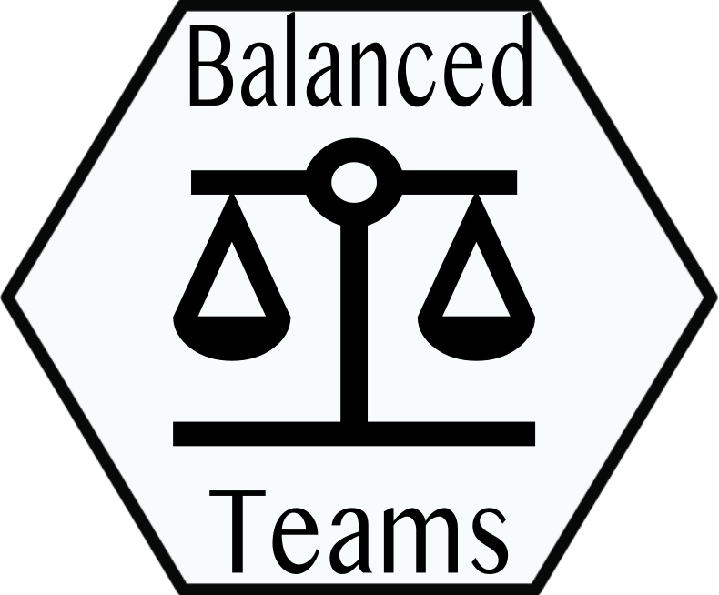

<!-- README.md is generated from README.Rmd. Please edit that file -->

```{r setup, include = FALSE}
knitr::opts_chunk$set(
  collapse = TRUE,
  comment = "#>",
  fig.path = "man/figures/README-",
  out.width = "100%"
)
```

#   balancedteams

<!-- badges: start -->
[](https://lifecycle.r-lib.org/articles/stages.html#experimental)
<!-- badges: end -->

The balancedteams R package offers a suite of methods --- currently two --- 
including a greedy heuristic algorithm as well as a 
[mixed integer linear programming](https://en.wikipedia.org/wiki/Integer_programming)
algorithm [@ompr] that creates a "balanced" set of team assignments according
to player scores and, optionally, accounting for a strata indicator. 
There are a number of ways to come up with this score but common methods used 
by our collaborators include an average of a self-survey and/or a captain’s 
assessment of a player’s athleticism.

## Installation

You can install the development version of balancedteams 
from [github](https://github.com/apeterson91/balancedteams) with:

``` r
devtools::install_github("apeterson91/balancedteams)
```

## Example

This is a basic example which shows you the basic input and output data
structures as well as the package syntax.

```{r libraries, message=FALSE,warning=FALSE}
library(balancedteams)
library(dplyr)
```

```{r aux_functions, echo = FALSE}
GetMeanScore <- function(df) {
  out <- dplyr::group_by(df, team_id) %>% 
  dplyr::summarize(`Mean Score` = mean(score),
                   `Median Score` = median(score),
            `# Players` = dplyr::n()) %>% 
  dplyr::arrange(team_id)
  
  return(out)
}
```

```{r view_data}
head(mens_team)
```

```{r algorithm}
team_config_one <- GenerateBalancedTeams(mens_team, 
                                         num_teams = 7,
                                         max_num_team = 11,
                                         method = "greedy")
GetMeanScore(team_config_one)
```


## Code of Conduct

Please note that the balancedteams project is released with a
[Contributor Code of Conduct](https://contributor-covenant.org/version/2/0/CODE_OF_CONDUCT.html). 
By contributing to this project, you agree to abide by its terms.
