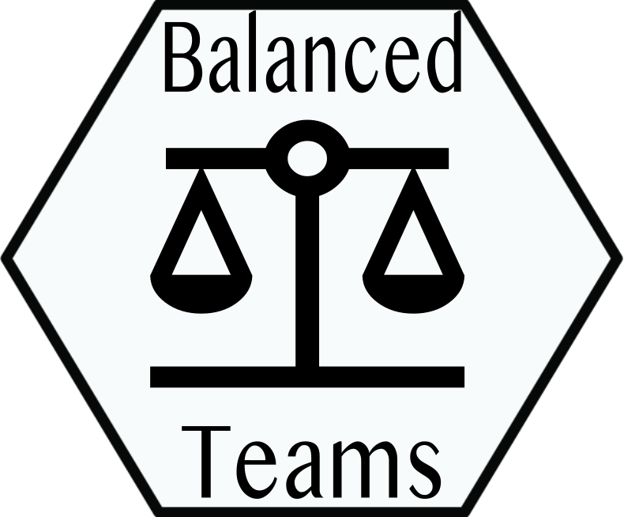

<!-- README.md is generated from README.Rmd. Please edit that file -->

#  balancedteams

<!-- badges: start -->

[](https://lifecycle.r-lib.org/articles/stages.html#experimental)
<!-- badges: end -->

The balancedteams R package offers a suite of methods — currently two —
including a greedy heuristic algorithm as well as a [mixed integer
linear programming](https://en.wikipedia.org/wiki/Integer_programming)
algorithm (Schumacher 2022) that each take a player or group (for
players that baggage together) score and assigns the “best” group to the
worst performing team, starting with some random initialization of the
teams. There are a number of ways to come up with this score but common
methods used by our collaborators include an average of a self-survey
and/or a captain’s assessment of a player’s athleticism.

## Installation

You can install the development version of balancedteams from
[github](https://github.com/apeterson91/balancedteams) with:

``` r
devtools::install_github("apeterson91/balancedteams)
```

## Example

This is a basic example which shows you the basic input and output data
structures as well as the package syntax.

``` r
library(balancedteams)
library(dplyr)
```

``` r
head(mens_team)
#>   group_id group_score
#> 1        1    52.58307
#> 2        2    56.81345
#> 3        3    45.01116
#> 4        4    62.80059
#> 5        5    43.71553
#> 6        6    39.33750
```

``` r
team_config_one <- GenerateBalancedTeams(mens_team$group_id, 
                                         mens_team$group_score,
                                         num_teams = 7,
                                         max_num_team = 11,
                                         method = "greedy")
GetMeanScore(team_config_one)
#> # A tibble: 7 × 4
#>   team_id `Mean Score` `Median Score` `# Players`
#>     <int>        <dbl>          <dbl>       <int>
#> 1       1         52.4           49.4          11
#> 2       2         52.4           50.7          11
#> 3       3         51.0           49.1          11
#> 4       4         48.9           48.0          11
#> 5       5         50.0           50.1          11
#> 6       6         48.8           47.7          11
#> 7       7         47.2           47.6          11
```

## Code of Conduct

Please note that the balancedteams project is released with a
[Contributor Code of
Conduct](https://contributor-covenant.org/version/2/0/CODE_OF_CONDUCT.html).
By contributing to this project, you agree to abide by its terms.

<div id="refs" class="references csl-bib-body hanging-indent">

<div id="ref-ompr" class="csl-entry">

Schumacher, Dirk. 2022. *Ompr: Model and Solve Mixed Integer Linear
Programs*. <https://github.com/dirkschumacher/ompr>.

</div>

</div>
